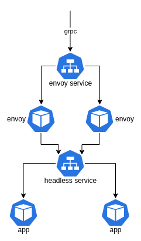

# Envoy GRPC LB
Helm chart to loadbalance GRPC with Envoy.



## How To
There are two ways this chart can be used.

Either by installing the chart standalone and passing it the service hostname.
```shell
helm repo add envoy-grpc-lb https://xenitab.github.io/envoy-grpc-lb
helm upgrade -i my-release envoy-grpc-lb/envoy-grpc-lb --set "loadbalancer.targetHost=foobar"
```

Or by including the chart as a dependcy in another chart.
**Chart.yaml**
```yaml
dependencies:
- name: "envoy-grpc-lb"
  version: "v0.1.0"
  repository: "https://xenitab.github.io/envoy-grpc-lb"
  condition: envoy-grpc-lb.enabled
```

**values.yaml**
```
envoy-grpc-lb:
  enabled: true
  loadbalancer:
    targetHost: foo
```
